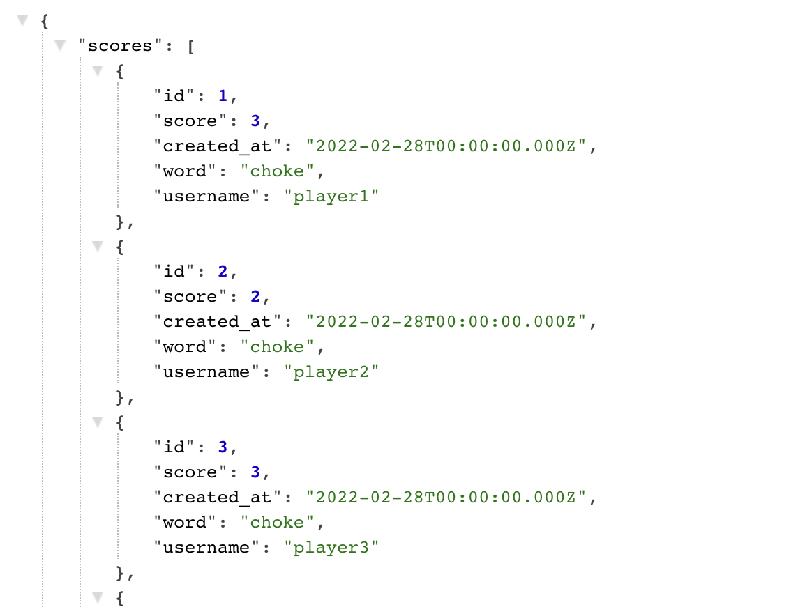
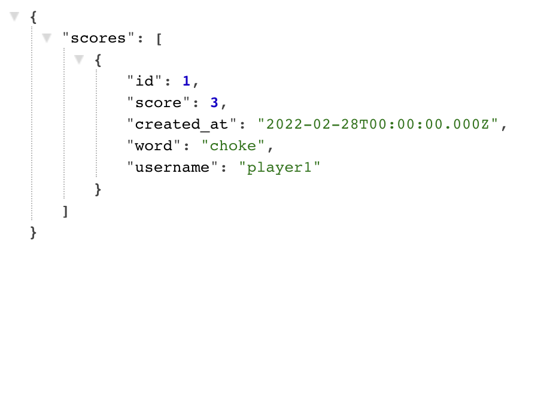
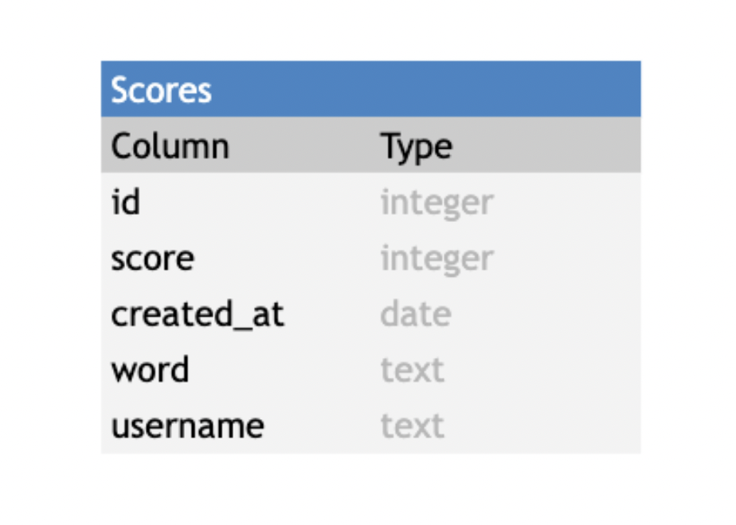

# Wrdle Backend Documentation

## Contents

- [Introduction](#introduction)
- [Technologies](#technologies)
- [Launch](#launch)
- [User Authentication](#user-authentication)
  - [Creating a session ID](#creating-a-session-id)
  - [Find a current user’s ID](#find-a-current-users-id)
  - [Registering a user](#registering-a-user)
  - [Validating a user log-in](#validating-a-user-log-in)
- [Country indicators](#country-indicators)
  - [Get all indicators on a country](#get-all-indicators-on-a-country)
  - [Find certain indicators on a country](#find-certain-indicators-on-a-country)
  - [Search for indicators in a specific timeframe](#search-for-indicators-in-a-specific-timeframe)
- [User’s searches in the database](#users-searches-in-the-database)
  - [Add a user's search to the database](#add-a-users-search-to-the-database)
  - [Get a the user’s search history](#get-a-users-search-history)
- [Database Schema](#database-schema)
- [License](#license)
- [Developers](#developers)

## Introduction

This is the backend server of the VR Wordle (Wrdle) app that handles http requests from the client to post scores and retrieve scores.

## Technologies

This repository uses [deno](https://deno.land/manual/getting_started/installation) to run its files.
For our database we use [PostgreSQL](https://www.postgresql.org/) to store world information and user data online using [ElephantSQL](https://www.elephantsql.com/).

## Launch

There is another repository which is closely related and can be found [here](https://github.com/kiranaatkar/vr-wordle-front-end). It is recommended that you create a folder and clone both the frontend and backend repos into the same folder.

Start by forking this backend repository, and then cloning the repository into your local drive. Toggle into the directory, /vr-wordle-back-end, and run the following command into your terminal to initiate the backend server:

```
deno run --allow-net --allow-read --allow-write --allow-env server.js
```

The frontend React application requires this backend server to be running to work correctly as it uses http://localhost:8080 as the API link in the development environment variables.

## Server Endpoints

### Retrieve scores

All stored scores are available in JSON format at the path `/scores`



Optional query parameters to refine the scores returned are

- word
- username
- date

e.g. the path `/scores?username=player1&word=choke` will return the following JSON object



If the query params are not 'word', 'date' or 'username', the server will respond with a 400 status code (bad request).

If no query params are included then **all** scores will be returned.

### Add a user's score to the database

Everytime a user wins a game, their score is stored along with the correct word, the date of submission, and the username of the player.

This is done with the POST HTTP Method to the `/scores` endpoint.

The body of the POST request **must** contain

- A score (integer) - the number of guesses before a correct answer
- The players username
- The correct answer

e.g. the following POST request will go through successfully

```
await fetch(`http://localhost:8080/scores`, {
	method: "POST",
	headers: {
		"Content-Type": "application/json",
	},
	body: JSON.stringify({
		score: 3,
		word: 'irate',
		username: 'johnDoe',
	}),
});
```

## Database Schema

### Scores Database



## License

The license for this project can be found [here](license.md)

## Developers

The Developers that worked on this project are:

Project Manager & Engineer: [Tamoor Waheed](https://github.com/TamoorW)<br/>
Architect & Engineer: [Kiran Aatkar](https://github.com/kiranaatkar)<br/>
Quality Assurance & Engineer: [Tom Waghorn](https://github.com/tomw13)<br/>
Quality Assurance & Engineer: [Omar Shueb](https://github.com/Omar-Shueb)
